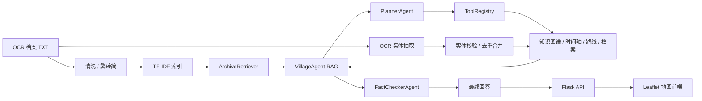

# 红色档案智能体：当前项目技术文档

> 适用版本：截至 2026-08 的当前开发版本  
> 面向对象：项目协作者、后端开发者、前端开发者、算法同学  
> 项目定位：基于云南省红军长征档案，构建“多村寨数字代言人 + 地图/时间轴可视化 + 档案知识图谱”的生成式智能体。

---

## 1. 项目概述

本项目围绕“云南省红军长征档案”构建一个可演示、可交互的 AI 智能体，主要解决三个问题：

1. **档案问答**：用户用自然语言提问，系统从 OCR 档案中检索真实依据，再由大模型以村寨代言人口吻回答。
2. **空间与时间可视化**：将红军长征路线、村寨位置、关键事件时间轴与地图交互结合，形成沉浸式场景。
3. **档案知识结构化**：从非结构化 OCR 文本中抽取人物、地点、部队、事件和关系，构建可查询、可扩展的知识图谱。

系统目前采用“RAG + 多智能体编排 + 知识图谱 + Web 可视化”的架构。

---

## 2. 当前已实现功能

### 2.1 档案 OCR 与索引

- 输入：已经过 OCR 识别的 PDF 文本文件，存放于 `data/ocr_output/`。
- 当前数据规模：约 18 个云南红军长征档案 TXT 文件。
- 文本预处理：繁体转简体、空行合并、OCR 页码噪声清理。
- 检索索引：基于 scikit-learn TF-IDF 构建字符级向量索引。
- 索引文件：`data/index/chunks.json`、`vectorizer.pkl`、`embeddings.npz`、`village_index.json`。
- 检索策略：优先限定村寨检索；若村寨命中文本块过少，则自动回退全库检索。

### 2.2 村寨数字代言人 RAG

- 支持村寨：皎平渡、石鼓、扎西、寻甸、柯渡、楚雄、昭通、曲靖、丽江、宣威、威信、禄劝。
- 每个村寨拥有独立人格 Prompt、头像和声线。
- 支持多轮记忆：按村寨隔离保存历史对话。
- 回答约束：历史数字、人名、日期、部队番号必须来自检索档案，避免幻觉。
- 闲聊边界：日常寒暄、路线咨询可自然回应，不强制附加档案来源。

### 2.3 多智能体任务规划与工具调用

系统不是简单“检索后生成”，而是具备复杂任务规划能力：

- `PlannerAgent`：判断问题是否复杂，生成 JSON 工具调用计划。
- `ToolRegistry`：实际执行工具。
- `OrchestratorAgent`：串联规划、工具执行、最终生成。
- 工具包括：
  - `search_archives`：检索档案片段。
  - `query_timeline`：查询时间轴。
  - `get_village_profile`：查询村寨档案。
  - `get_route`：获取行军路线。
  - `query_knowledge_graph`：查询知识图谱实体和关系。
  - `list_graph_nodes`：查看图谱节点类型。

### 2.4 事实校验 Agent

- `FactCheckerAgent` 对最终回答中的日期、数字、人名、地名、部队番号、战斗/会议名称进行二次校验。
- 输出结构化问题列表：`claim`、`evidence`、`severity`。
- 前端展示“事实校验”卡片，增强比赛演示中的可信度。

### 2.5 档案知识图谱

当前知识图谱包含两条来源：

1. **手工结构化基础图谱**：
   - 文件：`data/knowledge_graph/knowledge_graph.json`
   - 当前规模：22 个实体、29 条关系。
   - 实体类型：`person`、`location`、`event`、`army`。
   - 关系类型：`commander`、`participant`、`occurred_at`、`army`、`next_event`、`next_on_route`、`alias` 等。

2. **OCR 自动抽取图谱**：
   - 抽取脚本：`src/kg/extract_entities.py`
   - 支持 DeepSeek LLM 抽取和规则抽取两种模式。
   - 输出 `auto_extracted.json` 和合并预览 `knowledge_graph_auto.json`。
   - 支持方向修正、去重合并、`--remerge`、`--commit-preview`。

3. **实体自动校验**：
   - 脚本：`src/kg/validate_entities.py`
   - 规则模式：频次、名称长度、数字异常检测。
   - LLM 模式：调用 DeepSeek 判断实体真实性，自动修正 OCR 错字。
   - 输出 `validated_entities.json`、`review_required.json`、`knowledge_graph_clean.json`。

### 2.6 Web 可视化前端

前端为单页 Flask + Leaflet 地图，包含：

- 高德地图瓦片，展示云南区域。
- 两条长征路线：中央红军 1935、红二六军团 1936，不同颜色。
- 路线方向箭头。
- 村寨地点标记，点击后切换当前代言人。
- 红军战士角色沿路线平滑移动到点击地点。
- 村寨弹窗放在图标下方，避免遮挡战士。
- 底部时间轴展示关键事件。
- 数字人头像随村寨切换，男女不同声线。
- 语音合成与朗读，前端展示说话动效。
- “智能体规划”和“事实校验”结果卡片。
- “知识图谱”浮层：使用 vis-network 绘制实体关系网络，节点按类型着色。

### 2.7 语音合成

- 优先使用 edge-tts。
- 男声：`zh-CN-sichuan-YunxiNeural`、`zh-CN-YunxiNeural`。
- 女声：`zh-CN-XiaoxiaoNeural`、`zh-CN-XiaoyiNeural`。
- 网络失败时回退 Windows SAPI 本地语音。
- 最终失败时回退浏览器 `SpeechSynthesis`。

---

## 3. 系统架构



---

## 4. 数据流

### 4.1 普通问答链路

1. 前端 `POST /chat`。
2. `VillageAgent.ask()` 接收问题和村寨。
3. 判断是否复杂任务：
   - 复杂：进入 `OrchestratorAgent`，先规划再调用工具。
   - 普通：直接 `ArchiveRetriever.search()` 检索。
4. 用检索结果构建 Prompt。
5. DeepSeek 生成回答。
6. 必要时事实校验。
7. 返回回答、规划、校验结果给前端。

### 4.2 知识图谱构建链路

1. OCR 文本进入 `extract_entities.py`。
2. LLM 或规则抽取实体/关系。
3. 与基础图谱去重合并。
4. `validate_entities.py` 自动校验实体。
5. 生成 clean 图谱，可提交为正式 `knowledge_graph.json`。
6. 前端通过 `/api/knowledge_graph` 获取图数据并可视化。

---

## 5. 代码大纲

```text
项目根目录
├── build_pipeline.py                 # 旧版/备用：PDF 提取 + 清洗 + 索引
├── run_mineru.py                     # 旧版/可选：MinerU OCR 批量处理
├── config.yaml                       # 早期配置，部分内容已过期
├── requirements.txt                  # Python 依赖
├── README.md                         # 项目说明
├── src/
│   ├── agent/
│   │   ├── config.py                 # DeepSeek API、模型、路径、村寨列表
│   │   ├── knowledge.py              # 村寨坐标、路线、时间轴、头像、性别
│   │   ├── retriever.py              # TF-IDF 档案检索
│   │   ├── personas.py               # 村寨数字人 Prompt
│   │   ├── rag.py                    # 主 RAG Agent，多轮记忆
│   │   ├── planner.py                # 复杂任务规划
│   │   ├── tools.py                  # 工具注册与执行
│   │   ├── orchestrator.py           # 规划 → 工具 → 生成
│   │   ├── verifier.py               # 事实校验
│   │   ├── graph_store.py            # 知识图谱加载与查询
│   │   ├── main.py                   # 命令行交互入口
│   │   └── README.md                 # Agent 模块说明
│   ├── knowledge/
│   │   ├── indexer.py                # OCR 文本 → TF-IDF 索引
│   │   ├── rebuild_index.py          # 优化分块后重建索引
│   │   └── convert_t2s.py            # 繁体转简体
│   ├── kg/
│   │   ├── build_graph.py            # 图谱校验与统计
│   │   ├── extract_entities.py       # OCR 实体/关系自动抽取
│   │   ├── validate_entities.py      # 实体自动校验与 clean 图谱生成
│   │   └── README.md                 # 知识图谱模块说明
│   ├── ocr/
│   │   ├── pdf_processor.py          # 旧版 PaddleOCR 处理
│   │   ├── pdf_processor_mineru.py   # 旧版 MinerU 处理
│   │   ├── test_ocr.py               # OCR 环境测试
│   │   └── test_mineru.py            # MinerU 环境测试
│   └── web/
│       ├── app.py                    # Flask 后端 API
│       ├── tts.py                    # 语音合成
│       ├── templates/
│       │   └── index.html            # 地图 + 对话 + 时间轴 + 图谱前端
│       └── static/
│           ├── soldier.png           # 红军战士角色
│           └── avatars/              # 各村寨数字人头像
├── data/
│   ├── ocr_output/                   # OCR 档案文本
│   ├── index/                        # TF-IDF 索引
│   ├── knowledge_graph/              # 基础图谱、抽取结果、校验结果
│   └── tmp/                          # 临时文件
└── docs/
    ├── 当前项目技术文档.md
    └── 后续功能技术文档.md
```

---

## 6. 关键模块职责

| 模块 | 职责 | 核心类/函数 |
|------|------|-------------|
| `agent/config.py` | 全局配置 | `DEEPSEEK_API_KEY`、`MODEL_NAME`、`PROJECT_DIR`、`VILLAGES` |
| `agent/knowledge.py` | 共享结构化知识 | `VILLAGE_COORDS`、`ROUTES`、`TIMELINE` |
| `agent/retriever.py` | 档案检索 | `ArchiveRetriever.search()` |
| `agent/personas.py` | 数字人人格 Prompt | `build_system_prompt()` |
| `agent/rag.py` | 主 RAG Agent | `VillageAgent.ask()` |
| `agent/planner.py` | 任务规划 | `PlannerAgent.plan()` |
| `agent/tools.py` | 工具执行 | `ToolRegistry.tool_specs()`、`execute()` |
| `agent/orchestrator.py` | 编排 | `OrchestratorAgent.run()` |
| `agent/verifier.py` | 事实校验 | `FactCheckerAgent.verify()` |
| `agent/graph_store.py` | 图谱读取/查询 | `KnowledgeGraphStore.query()` |
| `kg/extract_entities.py` | 实体抽取 | `extract_from_ocr()`、`GraphMerger` |
| `kg/validate_entities.py` | 实体校验 | `validate_entities()`、`build_clean_graph()` |
| `web/app.py` | Web API | `/chat`、`/api/villages`、`/api/routes`、`/api/timeline`、`/api/knowledge_graph`、`/api/tts` |

---

## 7. 配置说明

### 7.1 LLM

- 模型：`deepseek-chat`。
- API：OpenAI 兼容接口，`BASE_URL=https://api.deepseek.com`。
- API Key：建议通过环境变量注入：
  - 推荐先复制 `.env.example` 为 `.env`，在项目根目录填写 `DEEPSEEK_API_KEY=sk-xxx`。
  - Windows PowerShell：`$env:DEEPSEEK_API_KEY="sk-xxx"`。
  - 不应把真实 Key 提交到 GitHub。

### 7.2 路径

当前默认项目目录：

```text
D:\agent kf\Red-Aechives-Agent
```

关键路径：

```text
data/ocr_output/       OCR 文本
data/index/            TF-IDF 索引
data/knowledge_graph/  知识图谱数据
src/web/static/        头像、战士图片
```

### 7.3 虚拟环境

当前开发环境：

```text
D:\agent kf\venv
```

运行命令示例：

```powershell
& "D:\agent kf\venv\Scripts\python.exe" "D:\agent kf\Red-Aechives-Agent\src\web\app.py"
```

---

## 8. 本地启动

### 8.1 安装依赖

```powershell
& "D:\agent kf\venv\Scripts\python.exe" -m pip install -r "D:\agent kf\Red-Aechives-Agent\requirements.txt"
```

### 8.2 设置 Key

```powershell
$env:DEEPSEEK_API_KEY="你的DeepSeekKey"
```

### 8.3 命令行测试

```powershell
& "D:\agent kf\venv\Scripts\python.exe" "D:\agent kf\Red-Aechives-Agent\src\agent\main.py"
```

### 8.4 启动 Web

```powershell
& "D:\agent kf\venv\Scripts\python.exe" "D:\agent kf\Red-Aechives-Agent\src\web\app.py"
```

浏览器访问：`http://127.0.0.1:5000`。

---

## 9. 后端 API

| 方法 | 路径 | 说明 |
|------|------|------|
| `GET` | `/` | 返回前端页面 |
| `POST` | `/chat` | 对话接口，返回回答、规划、事实校验 |
| `GET` | `/api/villages` | 村寨列表、坐标、头像、声线 |
| `GET` | `/api/routes` | 两条行军路线 |
| `GET` | `/api/timeline` | 时间轴事件 |
| `GET` | `/api/knowledge_graph` | 知识图谱节点和边 |
| `POST` | `/api/kg/query` | 按实体/主题查询图谱邻居 |
| `POST` | `/api/tts` | 文本转语音 |

---

## 10. 当前限制与风险

1. **检索仍是 TF-IDF**：对语义相近但字面不同的问题召回一般，建议升级向量检索。
2. **OCR 质量不稳定**：历史扫描件有大量 OCR 错字，图谱抽取会引入噪声。
3. **多轮记忆仅存在内存**：服务重启后丢失。
4. **事实校验依赖 LLM**：没有本地证据库硬约束，极端情况下仍可能漏报。
5. **前端依赖 CDN**：Leaflet、vis-network、高德瓦片依赖网络。
6. **部分早期文件未清理**：`run_mineru.py`、`src/ocr/test_*`、`src/ocr/pdf_processor*` 等已不是主链路。
7. **API Key 与档案数据不应提交**：协作上传 GitHub 前需要配置 `.gitignore`。

---

## 11. GitHub 上传前建议

- 使用 `.gitignore` 忽略 `venv/`、`data/ocr_output/`、`data/index/`、`data/tmp/`、`__pycache__/`。
- 使用 `.env.example` 说明环境变量。
- 将本技术文档与后续规划文档提交到 `docs/`。
- 删除或移入 `legacy/` 的早期脚本：`run_mineru.py`、`src/ocr/test_ocr.py`、`src/ocr/test_mineru.py`、`src/ocr/pdf_processor.py`、`src/ocr/pdf_processor_mineru.py`。
